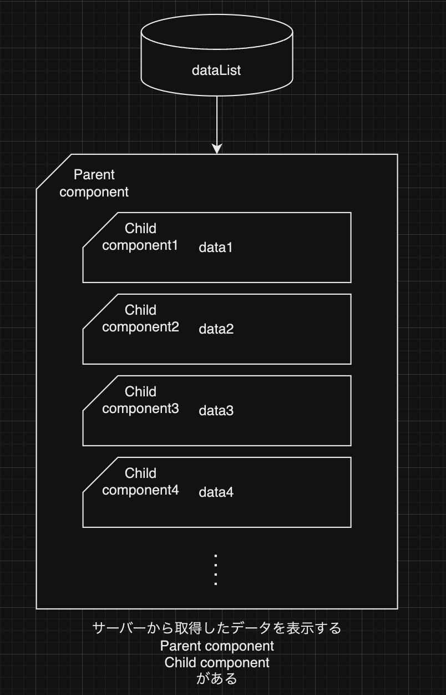
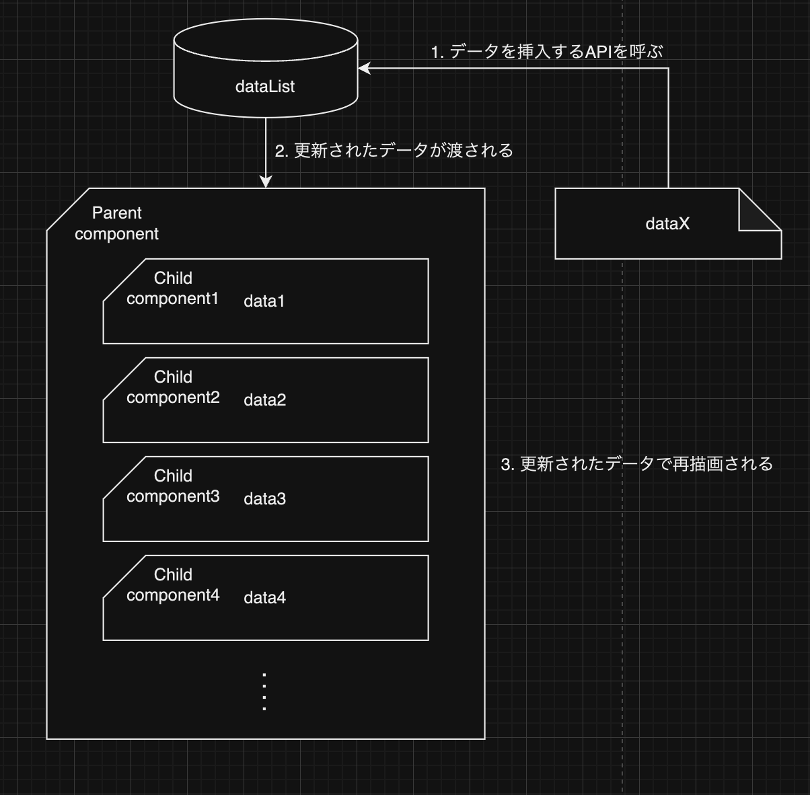
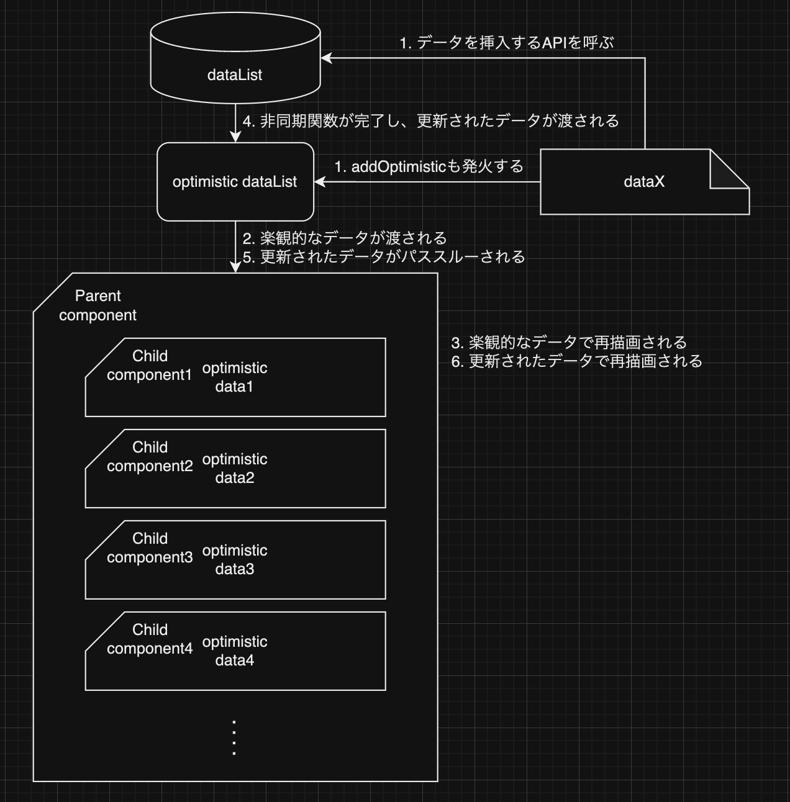

# React Hooksを使いこなしたい

## useTransition, useOptimistic編

2025/2/17

---

# 目次

1. useTransitionの紹介
2. useTransitionのユースケース
3. useOptimisticの紹介

---

<!--
_header: ""
-->

# useTransitionの紹介

---

<!--
header: "useTransitionの使い方"
-->

# useTransitionは何をしているのか

`startTransition`でラップすることでトランジションとしてマークすることができる

```tsx
const [isPending, startTransition] = useTransition();

startTransition(() => {
  // ここがトランジションとしてマークされる
});
```

トランジションとしてマークすることで、ノンブロッキングなUIを実現できる

---

ノンブロッキングってなに...? :thinking:

---

ユーザー操作に対して、アプリケーションが反応しなくなることがない状態

常にユーザーが操作できる状態を保たれていることによってユーザー体験の向上に繋がる

---

サンプルを見てみよう!

ex) サーバーと同期したカウントを表示するアプリケーション

---

## ブロッキングされている場合

`isLoading`が`true`の間はボタンが押せない→ブロックされている

```tsx
const [isLoading, setLoading] = useState();
const [count, setCount] = useState(0);

const increment = () => {
  setLoading(true);
  const newCount = await addCount(1);
  setLoading(false);
  setCount(newCount);
};

return (
  <div>
    <button onClick={increment} disabled={isLoading}>
      +1
    </button>
    {isLoading ? <p>同期中...</p> : count}
  </div>
);
```

---

## ブロッキングされていない場合

`isLoading`が`true`の間はボタンが押せない→ブロックされている

```tsx
const [isLoading, setLoading] = useState();
const [count, setCount] = useState(0);

const increment = () => {
  setLoading(true);
  const newCount = await addCount(1);
  setLoading(false);
  setCount(newCount);
};

return (
  <div>
    <button onClick={increment}>+1</button>
    {isLoading ? <p>同期中...</p> : count}
  </div>
);
```

---

ボタンを押すというユーザー操作をブロックしていない

→一見問題なさそうに見える :eyes:

---

#### `addCount`が重い処理だったとき、連打をすると...?

2回連打したときの処理

```plain
increment(1回目)開始 → increment(2回目)開始 → increment(1回目)終了 → increment(2回目)終了
```

ユーザーに見える値

```plain
同期中... → 同期中... → 1 → 2
```

`2`だけ表示されたらよいところが、ぬるっと不要な`1`が描画されてしまう

---

## useTransitionを使ってノンブロッキングなUIを実現した場合

```tsx
const [isPending, startTransition] = useTransition();
const [count, setCount] = useState(0);

const increment = () => {
  startTransition(async () => { // ブロック内をトランジションとしてマーク
    const newCount = await addCount(1);
    setCount(newCount);
 });
};

return (
  <div>
    <button onClick={increment}>+1</button>
    {isPending ? <p>同期中...</p> : count}
  </div>
);
```

---

トランジションとしてマークされた処理が完了するまで、`isPending`が`true`を返す
`startTransition`を複数回呼ぶと、すべてのトランジションが完了するまで`isPending`が`true`を返す

```tsx
const [isPending, startTransition] = useTransition();

...

const increment = () => {
  const newCount = await addCount(1);
  startTransition(() => {
    setCount(newCount);
  });
};
```

---

2回連打したときの処理

```plain
increment(1回目)開始 → increment(2回目)開始 → increment(1回目)終了 → increment(2回目)終了
```

ユーザーに見える値

```plain
同期中... → 同期中... → 同期中... → 2
```

---

## Tips

- [`useTransition`は実行順序を保証しない](https://ja.react.dev/reference/react/useTransition#my-state-updates-in-transitions-are-out-of-order)
  - 2番目のリクエストの後に1番目のリクエストが完了することがある
- `useTransition`でマークする処理は、`set`関数や非同期関数
  - `startTransition`内で呼ばれている全ての`set`関数にマーキングする
    - `@testing-library/react`の`act`と似たようなイメージでマーキングされる
  - v19からはAPI通信などの非同期関数もマーキングできるようになった

---

<!--
_header: ""
-->

# useTransitionのユースケース

---

<!--
header: "useTransitionのユースケース"
-->

- ノンブロッキングなUIを実現したいとき(前述)
- [保留中状態を視覚的に表示する](https://ja.react.dev/reference/react/useTransition#displaying-a-pending-visual-state)
- [望ましくないローディングインジケータの防止](https://ja.react.dev/reference/react/useTransition#preventing-unwanted-loading-indicators)
- [サスペンス対応ルータの構築](https://ja.react.dev/reference/react/useTransition#building-a-suspense-enabled-router)
- [エラーバウンダリでユーザにエラーを表示する](https://ja.react.dev/reference/react/useTransition#displaying-an-error-to-users-with-error-boundary)

---

<!--
_header: ""
-->

# useOptimisticの紹介

---

<!--
header: "useOptimisticの紹介"
-->

楽観的な更新を行うためのフック
バックグラウンドで更新系の通信が走っていても、ユーザーには即座に反映したように見せることができる

```tsx
const [optimisticState, addOptimistic] = useOptimistic(state, updateFn);
```

---

トランジション中は楽観的な値が表示される

```tsx
const [isPending, startTransition] = useTransition();
const [count, setCount] = useState(0);
const [displayCount, addOptimistic] = useOptimistic(
  count, // 第一引数はstate。トランジション中以外はパススルーされる
  (currentCount, diff) => { // 第二引数は楽観的な値を返す純粋関数
    return currentCount + diff;
 },
);

const increment = () => {
  startTransition(async () => {
    addOptimistic(1);
    const newCount = await addCount(1); // API通信と
    setCount(newCount); // set関数が完了されるまでは楽観的な値が表示される
});
};

return (
  <div>
    <button onClick={increment} disabled={isPending}>+1</button>
    <p>{displayCount}</p>
  </div>
);
```

---

サーバーから取得した配列の表示
<div class="flex sa">
<div>



表示

</div>
<div>
<div class="flex sa">
<div>



データの追加

</div>

<div>



データの追加(楽観的)

</div>

</div>
</div>
</div>

---

<!--
_header: "参考"
-->

- <https://ja.react.dev/reference/react/useTransition>
- <https://ja.react.dev/reference/react/useOptimistic>
- <https://zenn.dev/uhyo/books/react-19-new/viewer/actions>

---

ご清聴ありがとうございました :pray:
